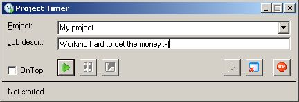



## Projekt Timer

### Description

Keep track of your hours you spend on programming jobs, I had the problem that I forgot to write down how many hours I used for my projects, and I did not get full paid for my work, so I needed a simple program that does not take to many minutes to work with.

Why download it:

1. If you need a timer

2. If you want to see how you can make csv files (comma based, good for viewing in excell)

3. If you need to see how to minimize to systray.

4. If you need to see how to open a file that is associated to excell

5. If you need a simple way to log errors.

6. etc...

Hope you like it
 
### More Info
 

             |
---                |---
**Submitted On**   |2005-11-29 13:37:08
**By**             |[Brian Kristensen Denmark](https://github.com/Planet-Source-Code/PSCIndex/blob/master/ByAuthor/brian-kristensen-denmark.md)
**Level**          |Advanced
**User Rating**    |4.6 (23 globes from 5 users)
**Compatibility**  |VB 6\.0
**Category**       |[Complete Applications](https://github.com/Planet-Source-Code/PSCIndex/blob/master/ByCategory/complete-applications__1-27.md)
**World**          |[Visual Basic](https://github.com/Planet-Source-Code/PSCIndex/blob/master/ByWorld/visual-basic.md)
**Archive File**   |[Projekt\_Ti19521211292005\.zip](https://github.com/Planet-Source-Code/brian-kristensen-denmark-projekt-timer__1-63414/archive/master.zip)

